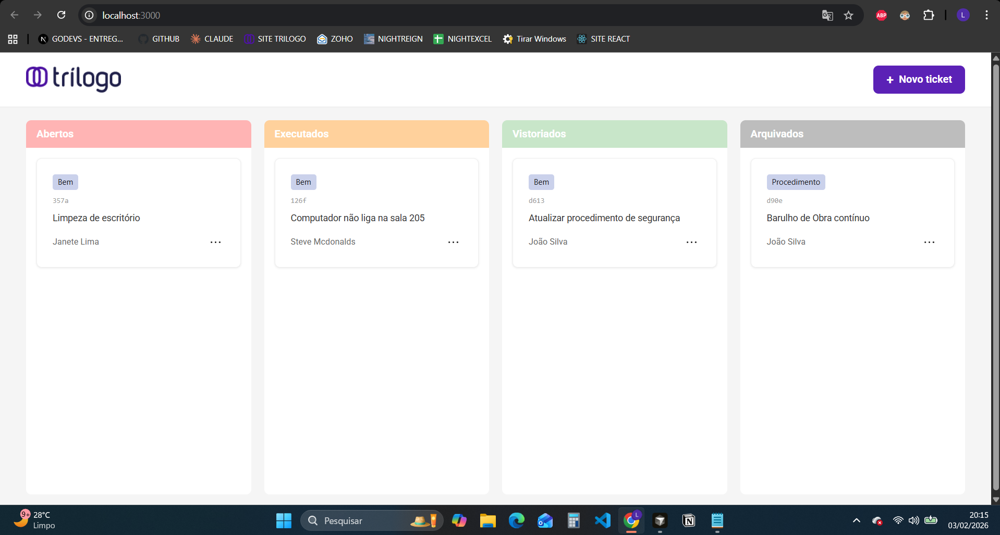

# 🎫 Sistema de Gestão de Tickets - Kanban

Sistema completo de gerenciamento de tickets em estilo Kanban, desenvolvido como parte do desafio técnico da Trilogo.



## 🚀 Sobre o Projeto

Aplicação web para gerenciar tickets de manutenção e procedimentos através de um board Kanban interativo com 4 colunas de status: Abertos, Executados, Vistoriados e Arquivados.

### ✨ Funcionalidades

- ✅ **CRUD Completo**: Criar, ler, editar e deletar tickets
- ✅ **Drag and Drop**: Arraste tickets entre colunas para mudar o status
- ✅ **Persistência de Dados**: LocalStorage mantém os dados após recarregar a página
- ✅ **Validação de Formulários**: Campos obrigatórios e validações customizadas
- ✅ **Interface Responsiva**: Adaptável para diferentes tamanhos de tela
- ✅ **Scroll Independente**: Cada coluna possui scroll próprio
- ✅ **Confirmação de Exclusão**: Modal de confirmação antes de deletar tickets

## 🛠️ Tecnologias Utilizadas

- **React 18** - Biblioteca JavaScript para interfaces
- **Vite** - Build tool moderna e rápida
- **Redux Toolkit** - Gerenciamento de estado global
- **Ant Design** - Biblioteca de componentes UI
- **React DnD** - Biblioteca para Drag and Drop
- **CSS Modules** - Estilização com escopo isolado
- **UUID** - Geração de IDs únicos

## 📋 Pré-requisitos

Antes de começar, você precisa ter instalado:

- [Node.js](https://nodejs.org/) (versão 16 ou superior)
- [npm](https://www.npmjs.com/) ou [yarn](https://yarnpkg.com/)

## 🔧 Instalação

1. **Clone o repositório**
```bash
git clone https://github.com/LucasValpereiro/trilogo-frontend-test.git
cd trilogo-frontend-test
```

2. **Instale as dependências**
```bash
npm install
```

3. **Execute o projeto**
```bash
npm run dev
```

4. **Acesse no navegador**
```
http://localhost:5173
```

## 📦 Build para Produção
```bash
npm run build
```

O build otimizado estará disponível na pasta `dist/`.

## 🎯 Como Usar

### Criar um Ticket
1. Clique no botão **"+ Novo ticket"**
2. Preencha a descrição (mínimo 10 caracteres)
3. Selecione o responsável
4. Selecione o tipo (Bem, Predial ou Procedimento)
5. Clique em **"Salvar"**

### Editar um Ticket
1. Clique nos **três pontos (⋯)** no card do ticket
2. Selecione **"Editar"**
3. Modifique os campos desejados
4. Clique em **"Atualizar"**

### Deletar um Ticket
1. Clique nos **três pontos (⋯)** no card do ticket
2. Selecione **"Deletar"**
3. Confirme a exclusão no modal

### Mover um Ticket
- **Opção 1**: Arraste o card e solte na coluna desejada
- A mudança é salva automaticamente

## 📂 Estrutura do Projeto
```
trilogo-frontend-test/
├── src/
│   ├── components/
│   │   ├── Board/
│   │   │   ├── Board.jsx
│   │   │   └── Board.module.css
│   │   ├── Header/
│   │   │   ├── Header.jsx
│   │   │   └── Header.module.css
│   │   ├── TicketCard/
│   │   │   ├── TicketCard.jsx
│   │   │   └── TicketCard.module.css
│   │   └── TicketForm/
│   │       ├── TicketForm.jsx
│   │       └── TicketForm.module.css
│   ├── redux/
│   │   └── slices/
│   │       ├── store.js
│   │       └── ticketsSlice.js
│   ├── assets/
│   ├── App.jsx
│   ├── main.jsx
│   └── global.css
├── package.json
├── vite.config.js
└── README.md
```

## 🎨 Paleta de Cores

- **Abertos**: `#FFB4B4` (Rosa)
- **Executados**: `#FFD19C` (Laranja)
- **Vistoriados**: `#C8E6C9` (Verde)
- **Arquivados**: `#BDBDBD` (Cinza)
- **Primária**: `#5b21b6` (Roxo)

## 💾 Persistência de Dados

Os dados são salvos automaticamente no **LocalStorage** do navegador:
- ✅ Criar ticket → salva
- ✅ Editar ticket → salva
- ✅ Deletar ticket → salva
- ✅ Mover ticket → salva

## 🧪 Testes

Este projeto foi testado manualmente em:
- ✅ Chrome (versão mais recente)
- ✅ Firefox (versão mais recente)
- ✅ Edge (versão mais recente)

### Cenários Testados
- [x] Criar ticket com todos os campos
- [x] Editar ticket existente
- [x] Deletar ticket com confirmação
- [x] Mover ticket via drag and drop
- [x] Validações de formulário
- [x] Persistência após reload (F5)
- [x] Scroll independente nas colunas

## 🚧 Melhorias Futuras

- [ ] Filtros por tipo e responsável
- [ ] Busca de tickets por descrição
- [ ] Upload de imagens nos tickets
- [ ] Histórico de mudanças
- [ ] Notificações
- [ ] Dark mode

## 📝 Requisitos Atendidos

### Obrigatórios
- ✅ CRUD completo de Tickets
- ✅ Kanban com 4 colunas
- ✅ Campos: Descrição, Responsável, Tipo
- ✅ Tipos: Bem, Predial, Procedimento
- ✅ Novos tickets começam em "Aberto"
- ✅ Menu de opções (Editar, Deletar)
- ✅ Movimentação entre colunas
- ✅ React JS
- ✅ Redux para gerenciamento de estado

### Diferenciais
- ✅ CSS Modules
- ✅ Ant Design
- ✅ Persistência em LocalStorage
- ✅ Drag and Drop (React DnD)

## 👨‍💻 Autor

**Seu Nome**
- GitHub: [@LucasValpereiro](https://github.com/LucasValpereiro)
- LinkedIn: [www.linkedin.com/in/lucas-valpereiro-6876111b5](www.linkedin.com/in/lucas-valpereiro-6876111b5)
- Email: lucasvalpereiro@hotmail.com

## 📄 Licença

Este projeto foi desenvolvido como parte de um desafio técnico para a Trilogo.

---

⭐ Se este projeto te ajudou, deixe uma estrela!
```

---

## 📸 **PASSO 1: Tirar Screenshot**

Antes de fazer o commit:

1. **Abra sua aplicação no navegador**
2. **Tire um print da tela completa** (com alguns tickets em várias colunas)
3. **Salve como `preview.png`** na raiz do projeto

---

## 🚀 **PASSO 2: Preparar para o GitHub**

### **1. Edite o README.md:**

Substitua estas informações:
- `SEU-USUARIO` → seu username do GitHub
- `Seu Nome` → seu nome completo
- `seu-email@exemplo.com` → seu email
- Links do LinkedIn e GitHub

### **2. Verifique o .gitignore:**

Certifique-se que existe um arquivo `.gitignore` na raiz:
```
# Dependencies
node_modules/

# Build
dist/

# Environment
.env
.env.local

# IDE
.vscode/
.idea/

# OS
.DS_Store
Thumbs.db